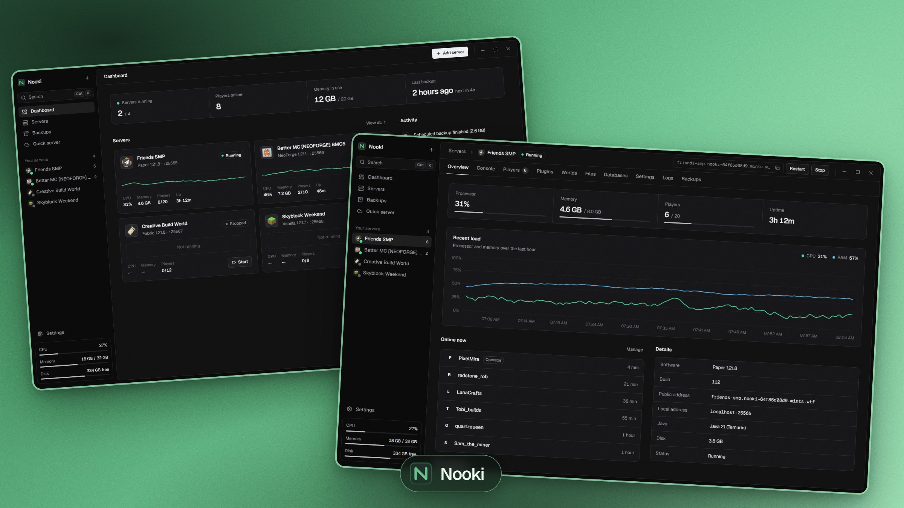
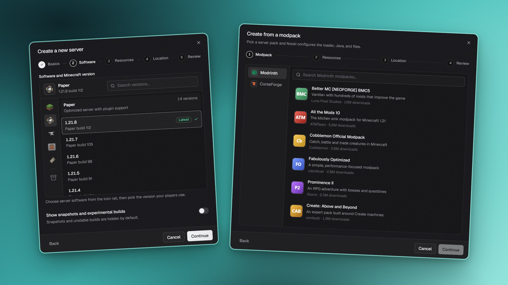
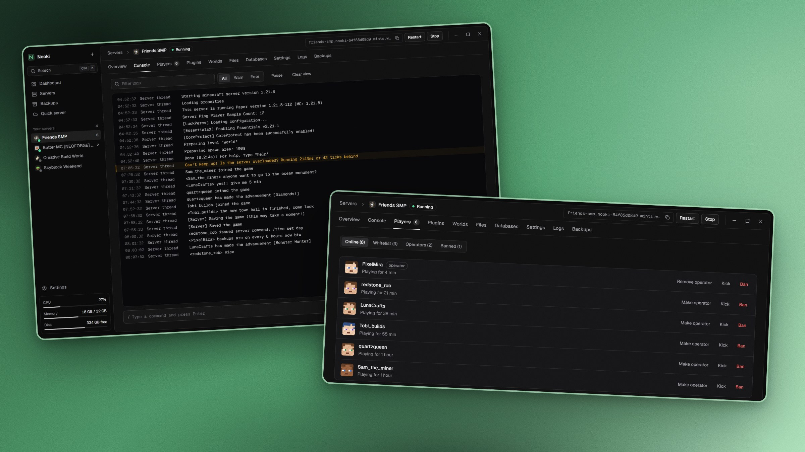
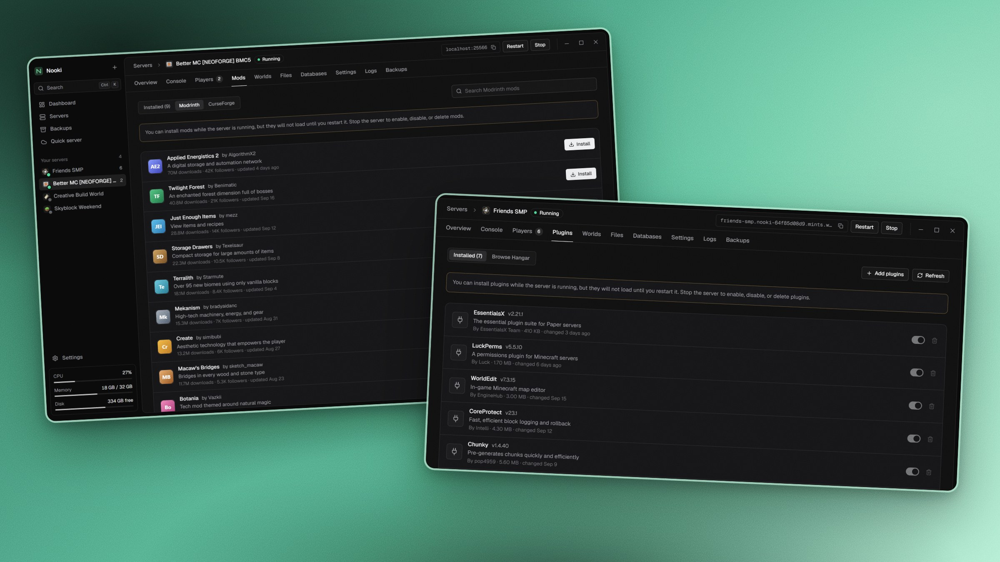
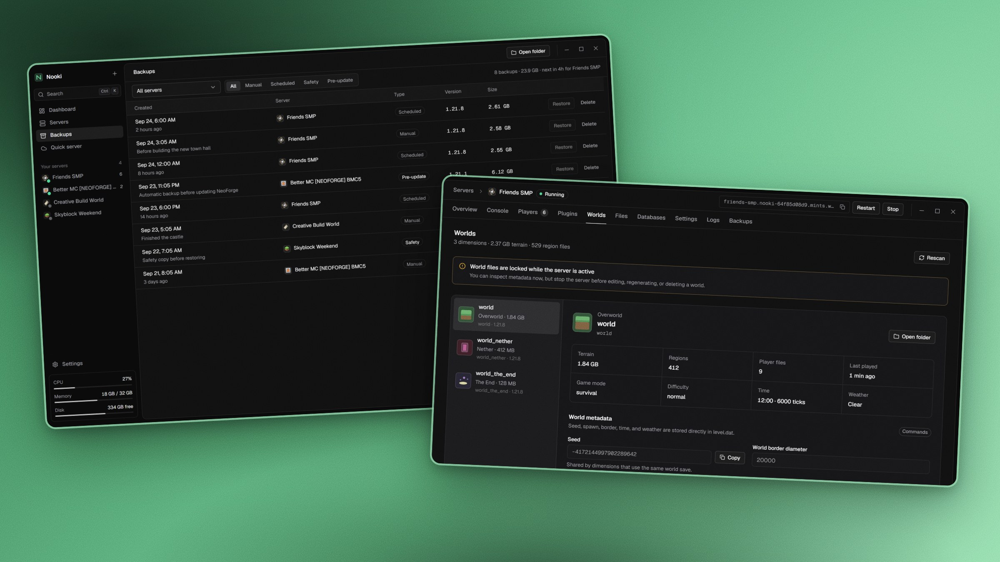
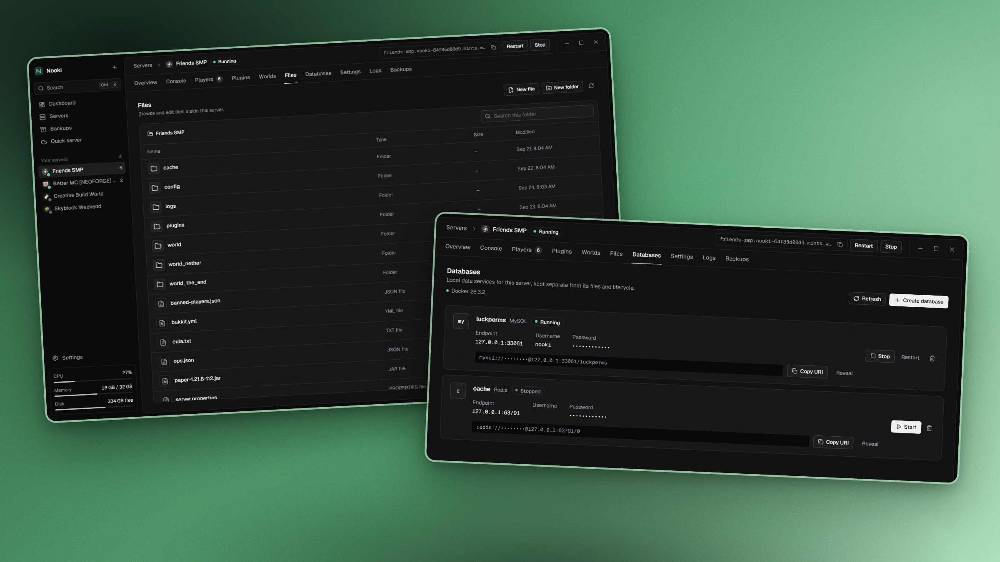
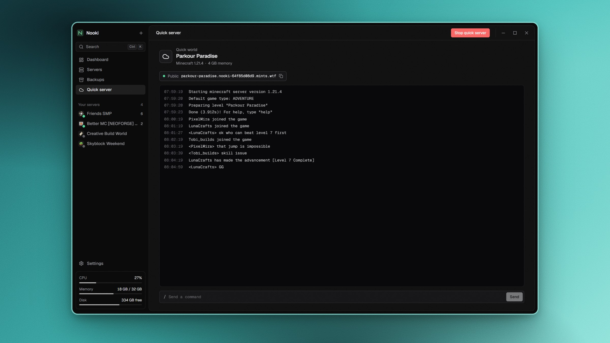

<h1 align="center">
  
  <br>
  Nooki
</h1>

<p align="center">
  <strong>Host your own Minecraft server without the headache.</strong>
</p>

<p align="center">
  Nooki is a free Windows app that sets up, runs, and looks after Minecraft servers for you.<br>
  No command line, no config files, no Java setup.
</p>

<h4 align="center">
  <a href="https://github.com/veyzyn/nooki/stargazers"></a>
  <a href="https://github.com/veyzyn/nooki/releases"></a>
  <a href="https://github.com/veyzyn/nooki/actions/workflows/build-windows.yml"></a>
  <a href="LICENSE"></a>
</h4>

<p align="center">
  <a href="https://github.com/veyzyn/nooki/releases/latest"><strong>⬇ Download for Windows</strong></a> &middot;
  <a href="#frequently-asked-questions">FAQ</a> &middot;
  <a href="https://github.com/veyzyn/nooki/issues/new">Report a bug</a> &middot;
  <a href="https://github.com/veyzyn/nooki/issues/new">Request a feature</a>
</p>



## What is Nooki?

Running a Minecraft server usually means installing the right Java version, editing text files, keeping a terminal window open, and hoping you remembered to make a backup. Nooki takes care of those jobs so you can get on with playing.

Choose the kind of server you want, and Nooki downloads it, sets it up, and starts it. After that, one window shows who is online, what the server is doing, and every setting you are likely to need.

It is made for people who want to host for friends, try out a modpack, or keep a long-running world, whether or not they have run a server before.

> [!NOTE]
> Nooki is still in early development. Things may move around, and some updates may bring breaking changes before version 1.0.

## Get started in 3 steps

1. **Download** `Nooki-Windows-x64.exe` from the [latest release](https://github.com/veyzyn/nooki/releases/latest).
2. **Open it.** You don't have to install anything. Keep the file wherever you like, for example on your desktop.
3. **Click _Add server_** and pick one of these:
   - **Create a new server** for a fresh world
   - **Install a modpack** from Modrinth or CurseForge
   - **Import an existing server** that is already on your computer

When the server is ready, press **Start**, open Minecraft, and join `localhost`.

> [!TIP]
> Windows might say *"Windows protected your PC"* the first time you open Nooki. This happens because the app isn't code-signed yet. Click **More info**, then **Run anyway**.

### What you need

| | |
|---|---|
| **Computer** | Windows 10 or 11 (64-bit) |
| **Java** | Nothing to do. Nooki finds the right version or downloads it for you |
| **Memory** | About 2–4 GB free for a normal server, and more for big modpacks |
| **Internet** | Needed while downloading server files, mods, or plugins |
| **Docker Desktop** | Only if you want to use the Databases tab ([download](https://www.docker.com/products/docker-desktop/)) |

## What Nooki can do

### Make a server in a few clicks



- **Vanilla, Paper, Fabric, Forge, and NeoForge**, any version from a searchable list
- **Modpacks from Modrinth and CurseForge**, installed with the right mod loader and Java version
- **Bring your own server.** Point Nooki at a folder, and your world and settings stay exactly where they are
- A step-by-step setup with progress you can follow, so you always know what's happening

### See everything at a glance



- A **dashboard** with every server, who's playing, and how hard your computer is working
- A **live console** where you can read the log and type commands
- **Players:** see who's online, then kick, ban, make operators, or manage the whitelist with a click
- Processor and memory **graphs** for the last hour
- **Multiple servers** side by side, each with its own start, stop, and restart buttons

### Add mods and plugins without leaving the app



- Search **Modrinth and CurseForge** for mods that match your server's version and loader
- Browse **Paper plugins** and install them in one click
- Turn mods and plugins on or off, or remove them, without digging through folders

### Never lose a world



- **One-click backups**, plus **automatic backups** every hour, day, or week
- Nooki makes a **safety backup** before restoring or updating, so you can always go back
- Look through your **worlds and dimensions**, copy seeds, and change spawn, world border, time, and weather

### Handy tools for the details



- A **file browser and editor** for configs like `server.properties`, with no need to open File Explorer
- **Databases** (MySQL, PostgreSQL, MongoDB, Redis) in a couple of clicks, for plugins that need one
- Every past **log session**, ready to read or export when something goes wrong

### Quick server: drop in a map and play



Downloaded a parkour or adventure map? Drop the world folder or ZIP onto **Quick server**. Nooki detects the Minecraft version and starts a temporary server, then cleans up after itself when you stop it.

### Play with friends

Nooki can give your server a **public address** so friends can join from anywhere, without router settings or port forwarding. Sharing is a limited feature for now and needs an activation key. Everything else in Nooki works without one.

## Frequently asked questions

<details>
<summary><strong>Is Nooki free?</strong></summary>

Yes. Nooki is free and open source under the [MIT License](LICENSE).
</details>

<details>
<summary><strong>Where are my servers and backups stored?</strong></summary>

On your own computer, in `Documents\Nooki\Servers` and `Documents\Nooki\Backups` by default. You can change both folders in **Settings**. Nothing is uploaded anywhere.
</details>

<details>
<summary><strong>Do I need to install Java?</strong></summary>

No. Nooki uses a Java version that's already on your computer if it fits the server. Otherwise it downloads the correct one automatically.
</details>

<details>
<summary><strong>Can I use a server I already have?</strong></summary>

Yes. Choose **Add server → Import an existing server** and select its folder. Nooki works with the files where they are and doesn't move or copy them.
</details>

<details>
<summary><strong>What happens when I close the window?</strong></summary>

By default, Nooki keeps running in the system tray so your servers stay online. If you quit Nooki completely, it saves each world and stops your servers safely first. You can change this in **Settings**.
</details>

<details>
<summary><strong>How do my friends join?</strong></summary>

Friends on the same Wi-Fi or network can join with your computer's local IP address and the server's port. Friends elsewhere can join through a Nooki public address (see [Play with friends](#play-with-friends)), or you can set up port forwarding on your router yourself.
</details>

<details>
<summary><strong>How do I update Nooki?</strong></summary>

Download the newest `Nooki-Windows-x64.exe` from the [releases page](https://github.com/veyzyn/nooki/releases/latest) and use it in place of the old one. Your servers, backups, and settings stay where they are.
</details>

<details>
<summary><strong>Does it work on macOS or Linux?</strong></summary>

Not yet. Nooki currently supports 64-bit Windows 10 and 11 only.
</details>

<details>
<summary><strong>Some CurseForge mods won't download. Why?</strong></summary>

Some CurseForge authors don't allow downloads through other apps. When that happens, Nooki opens the official download page and picks up the file once your browser has downloaded it.
</details>

<details>
<summary><strong>Something went wrong. Where do I get help?</strong></summary>

[Open an issue](https://github.com/veyzyn/nooki/issues/new) and describe what happened. The **Logs** tab for your server usually has useful details you can copy in.
</details>

## For developers

<details>
<summary><strong>Build Nooki from source</strong></summary>

### Requirements

- Windows 10 or 11, x64
- [Rust](https://www.rust-lang.org/tools/install) with the MSVC toolchain
- [Node.js](https://nodejs.org/) and [pnpm](https://pnpm.io/)
- Microsoft WebView2
- [Go](https://go.dev/doc/install) only when working on the relay service
- Docker Desktop only when testing databases

### Run Nooki from source

```powershell
pnpm install
pnpm tauri dev
```

### Create a release build

```powershell
pnpm tauri build
```

### Run the project checks

```powershell
pnpm build
pnpm test
cargo fmt --manifest-path src-tauri/Cargo.toml -- --check
cargo clippy --manifest-path src-tauri/Cargo.toml --all-targets -- -D warnings
cargo test --manifest-path src-tauri/Cargo.toml

Push-Location relay
go test ./...
Pop-Location
```

The [Build Nooki workflow](https://github.com/veyzyn/nooki/actions/workflows/build-windows.yml) runs these checks and produces a downloadable Windows executable for every push to `main` and every pull request. Each successful `main` build updates a single [development prerelease](https://github.com/veyzyn/nooki/releases/tag/development), while tagged versions such as `v0.1.0` are published as normal releases.

Checks and packaging run in parallel, and GitHub caches Rust and frontend dependencies to make repeat builds substantially faster than the first cold build.

### Build configuration

Official builds provide the contact information used when downloading Paper and the API key used for CurseForge. If you build Nooki yourself, place your own values in a local `.cargo/config.toml`:

```toml
[env]
NOOKI_CONTACT_URL = "your-public-support-url-or-email"
NOOKI_CURSEFORGE_API_KEY = "your-curseforge-api-key"
```

Keep that file local and never commit real credentials. Modrinth does not require an API key.

The relay service lives in [`relay/`](relay/README.md). Its deployment guide and technical details are kept there so the main README can stay focused on the app.

</details>

## Contributing

Bug reports, ideas, and pull requests are welcome. Have a look at [CONTRIBUTING.md](CONTRIBUTING.md) before sending a change. Please report security problems privately by following [SECURITY.md](SECURITY.md), rather than opening a public issue.

If Nooki is useful to you, starring the repository is an easy way to support the project and help other self-hosters find it.

## Star History

<a href="https://www.star-history.com/?repos=veyzyn%2Fnooki&type=date&legend=top-left">
 <picture>
   <source media="(prefers-color-scheme: dark)" srcset="https://api.star-history.com/chart?repos=veyzyn/nooki&type=date&theme=dark&legend=top-left&sealed_token=UhcRpIE3qWoHu62rT5PmrjOWYvvpiednnesP5WEwTH3CHq5lQS611aAjdOqwOXoRVoljsnKaN0Hv0CUjSbbhKqxnQYBMV17htnVaYzQDsROaXk4KqtSNMYimIQLKrEWljab86wqGEY6e13RS21EeVVfOc-DGwHNpbVG_l5ae1ceNCFaxVsJBOMHuC1Jz" />
   <source media="(prefers-color-scheme: light)" srcset="https://api.star-history.com/chart?repos=veyzyn/nooki&type=date&legend=top-left&sealed_token=UhcRpIE3qWoHu62rT5PmrjOWYvvpiednnesP5WEwTH3CHq5lQS611aAjdOqwOXoRVoljsnKaN0Hv0CUjSbbhKqxnQYBMV17htnVaYzQDsROaXk4KqtSNMYimIQLKrEWljab86wqGEY6e13RS21EeVVfOc-DGwHNpbVG_l5ae1ceNCFaxVsJBOMHuC1Jz" />
   
 </picture>
</a>

## A note on how Nooki is made

Everything here is vibecoded with the help of GPT-5.6 Sol. The project is still tested, reviewed, and improved like any other open-source project; the unusual part is simply how much of it was built through conversations with an AI.

The screenshots in this README use sample servers and players.

Minecraft and related artwork are trademarks of Mojang Studios and Microsoft. The names and marks of PaperMC, FabricMC, Forge, NeoForged, Modrinth, CurseForge, and Docker belong to their respective owners. Nooki is an independent project and is not affiliated with or endorsed by any of them. See [THIRD_PARTY_NOTICES.md](THIRD_PARTY_NOTICES.md) for more information.

## License

Nooki is open source under the [MIT License](LICENSE).
