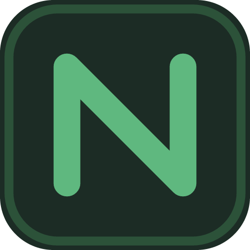

<h1 align="center">
  
  <br>
  Nooki
</h1>

<p align="center">
  <strong>A friendly Minecraft server manager for Windows.</strong>
</p>

<p align="center">
  Create a server, bring your own, add mods and plugins, make backups, and keep an eye on everything from one clean desktop app.
</p>

<h4 align="center">
  <a href="https://github.com/veyzyn/nooki/stargazers"></a>
  <a href="https://github.com/veyzyn/nooki/releases"></a>
  <a href="https://github.com/veyzyn/nooki/actions/workflows/build-windows.yml"></a>
  <a href="LICENSE"></a>
</h4>

<p align="center">
  <a href="https://github.com/veyzyn/nooki/releases/latest">Download Nooki</a> &middot;
  <a href="https://github.com/veyzyn/nooki/issues/new">Report a bug</a> &middot;
  <a href="https://github.com/veyzyn/nooki/issues/new">Request a feature</a>
</p>

---


## Minecraft servers should not need a control room

Nooki is for people who want to host Minecraft on their own computer without spending the evening juggling Java versions, terminal windows, configuration files, and backup folders.

Pick the kind of server you want, choose a Minecraft version, and Nooki takes care of the setup. Once it is running, the same app gives you the console, players, worlds, files, performance, mods, plugins, and backups you actually need.

Nooki is still in early development. Things may move around, some releases may be rough, and breaking changes are possible before version 1.0.

## What you can do

- Create Vanilla, Paper, Fabric, Forge, and NeoForge servers.
- Import Minecraft servers you already have without moving their files.
- Build modded servers from Modrinth and CurseForge modpacks.
- Find and install mods or Paper plugins from inside Nooki.
- Start, stop, restart, and watch multiple servers from one dashboard.
- Use a live console and see player activity, logs, memory use, and processor use.
- Browse worlds and dimensions, view their seeds, and change common world settings.
- Make backups on demand or on a schedule, then restore them when needed.
- Drop in a world folder or ZIP to spin up a lightweight Quick server.
- Easily create databases for servers and plugins that need one.
- Share a server with friends using a simple Nooki address.

## Download

Nooki currently supports **64-bit Windows 10 and Windows 11**.

1. Go to the [latest release](https://github.com/veyzyn/nooki/releases/latest).
2. Download `Nooki-Windows-x64.exe`.
3. Put it wherever you like and open it.
4. Create a new server or import an existing server folder.

Nooki is a single portable executable, so there is no installer to work through. Windows SmartScreen may show a warning while builds are unsigned.

### What else do I need?

- Enough memory and disk space for the servers you want to run.
- An internet connection while downloading server files, Java, mods, or plugins.
- [Docker Desktop](https://www.docker.com/products/docker-desktop/) only if you want to use the Databases tab.

You do not need to install Java first. Nooki can find Java already on your computer or download the right version when it is needed. Microsoft WebView2 is also required, but it is already included with most current Windows installations.

Server sharing is currently a limited feature and requires an activation key. Everything else works without one.

## A closer look

### Set up the server you actually want

Start small with Vanilla or Paper, use Fabric, Forge, or NeoForge for mods, or install a complete Modrinth or CurseForge server pack. Nooki matches the server with an appropriate Java version and shows real progress while it downloads and prepares everything.

### Keep day-to-day hosting simple

The dashboard keeps server status and computer usage visible without getting in the way. Each server has its own focused controls for the console, players, worlds, plugins or mods, databases, settings, logs, and backups.

### Recover when experiments go wrong

Back up a server before changing it, keep automatic backups on a schedule, and restore an older copy from the app. Nooki stores server data on your computer, where you remain in control of it.

### Start a map in a hurry

Quick server is made for parkour maps, adventure maps, and short sessions. Give it a world folder or ZIP, let Nooki detect what it needs, and get straight to playing with a small, temporary server.

## Build it yourself

### Requirements

- Windows 10 or 11, x64
- [Rust](https://www.rust-lang.org/tools/install) with the MSVC toolchain
- [Node.js](https://nodejs.org/) and [pnpm](https://pnpm.io/)
- Microsoft WebView2
- [Go](https://go.dev/doc/install) only when working on the relay service
- Docker Desktop only when testing databases

### Run Nooki from source

```powershell
pnpm install
pnpm tauri dev
```

### Create a release build

```powershell
pnpm tauri build
```

### Run the project checks

```powershell
pnpm build
pnpm test
cargo fmt --manifest-path src-tauri/Cargo.toml -- --check
cargo clippy --manifest-path src-tauri/Cargo.toml --all-targets -- -D warnings
cargo test --manifest-path src-tauri/Cargo.toml

Push-Location relay
go test ./...
Pop-Location
```

The [Build Nooki workflow](https://github.com/veyzyn/nooki/actions/workflows/build-windows.yml) runs these checks and produces a downloadable Windows executable for every push to `main` and every pull request. Each successful `main` build updates a single [development prerelease](https://github.com/veyzyn/nooki/releases/tag/development), while tagged versions such as `v0.1.0` are published as normal releases.

## Build configuration

Official builds provide the contact information used when downloading Paper and the API key used for CurseForge. If you build Nooki yourself, place your own values in a local `.cargo/config.toml`:

```toml
[env]
NOOKI_CONTACT_URL = "your-public-support-url-or-email"
NOOKI_CURSEFORGE_API_KEY = "your-curseforge-api-key"
```

Keep that file local and never commit real credentials. Modrinth does not require an API key. Some CurseForge projects do not allow downloads through third-party apps; when that happens, Nooki takes you to the official download page and helps pick up the downloaded file.

The relay service lives in [`relay/`](relay/README.md). Its deployment guide and technical details are kept there so the main README can stay focused on the app.

## Contributing

Bug reports, ideas, and pull requests are welcome. Have a look at [CONTRIBUTING.md](CONTRIBUTING.md) before sending a change. Please report security problems privately by following [SECURITY.md](SECURITY.md), rather than opening a public issue.

If Nooki is useful to you, starring the repository is an easy way to support the project and help other self-hosters find it.

## Star History

<a href="https://www.star-history.com/?repos=veyzyn%2Fnooki&type=date&legend=top-left">
 <picture>
   <source media="(prefers-color-scheme: dark)" srcset="https://api.star-history.com/chart?repos=veyzyn/nooki&type=date&theme=dark&legend=top-left&sealed_token=UhcRpIE3qWoHu62rT5PmrjOWYvvpiednnesP5WEwTH3CHq5lQS611aAjdOqwOXoRVoljsnKaN0Hv0CUjSbbhKqxnQYBMV17htnVaYzQDsROaXk4KqtSNMYimIQLKrEWljab86wqGEY6e13RS21EeVVfOc-DGwHNpbVG_l5ae1ceNCFaxVsJBOMHuC1Jz" />
   <source media="(prefers-color-scheme: light)" srcset="https://api.star-history.com/chart?repos=veyzyn/nooki&type=date&legend=top-left&sealed_token=UhcRpIE3qWoHu62rT5PmrjOWYvvpiednnesP5WEwTH3CHq5lQS611aAjdOqwOXoRVoljsnKaN0Hv0CUjSbbhKqxnQYBMV17htnVaYzQDsROaXk4KqtSNMYimIQLKrEWljab86wqGEY6e13RS21EeVVfOc-DGwHNpbVG_l5ae1ceNCFaxVsJBOMHuC1Jz" />
   
 </picture>
</a>

## A note on how Nooki is made

Everything here is vibecoded with the help of GPT-5.6 Sol. The project is still tested, reviewed, and improved like any other open-source project; the unusual part is simply how much of it was built through conversations with an AI.

Minecraft and related artwork are trademarks of Mojang Studios and Microsoft. The names and marks of PaperMC, FabricMC, Forge, NeoForged, Modrinth, CurseForge, and Docker belong to their respective owners. Nooki is an independent project and is not affiliated with or endorsed by any of them. See [THIRD_PARTY_NOTICES.md](THIRD_PARTY_NOTICES.md) for more information.

## License

Nooki is open source under the [MIT License](LICENSE).
